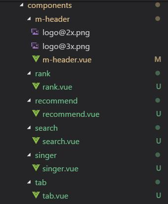
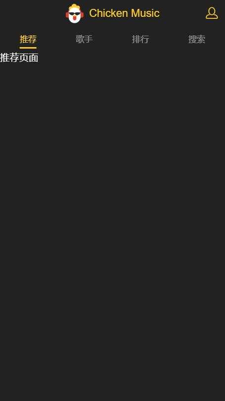

# header组件以及页面骨架

## 目录
[**1-基本配置**](#1-基本配置)

[**2-页面骨架**](#2-页面骨架)

[**3-页面效果**](#3-页面效果)

## <a id="1-基本配置"></a>1-基本配置

index.html
```html
<!-- 移动端视口 -->
<meta name="viewport" content="width=device-width, initial-scale=1.0, maximum-scale=1.0, minimum-scale=1.0, user-scalable=no">
```

## <a id="2-页面骨架"></a>2-页面骨架

添加header，tab，及tab内容页面



Tab栏(components/tab/tab.vue)
```html
<router-link tag="div" class="tab-item" to="/recommend">
  <span class="tab-link">推荐</span>
</router-link>
<router-link tag="div" class="tab-item" to="/singer">
  <span class="tab-link">歌手</span>
</router-link>
<router-link tag="div" class="tab-item" to="/rank">
  <span class="tab-link">排行</span>
</router-link>
<router-link tag="div" class="tab-item" to="/search">
  <span class="tab-link">搜索</span>
</router-link>
```
内容页面组件模板
```html
<template>
  <div>
    推荐页面
  </div>
</template>

<script type="text/ecmascript-6">
export default {}
</script>

<style scoped lang="stylus" rel="stylesheet/stylus">

</style>
```
App.vue
```html
<template>
  <div id="app">
    <m-header></m-header>
    <tab></tab>
    <router-view></router-view>
  </div>
</template>

<script type="text/ecmascript-6">
import MHeader from 'components/m-header/m-header.vue' // 头部组件
import Tab from 'components/tab/tab.vue' // tab栏
export default {
  components: {
    MHeader,
    Tab
  }
}
</script>
```
路由跳转(router/index.js)
```js
import Recommend from 'components/recommend/recommend.vue' // 推荐页面
import Singer from 'components/singer/singer.vue' // 歌手页面
import Rank from 'components/rank/rank.vue' // 排行页面
import Search from 'components/search/search.vue' // 搜索页面

export default new Router({
  routes: [
    {
      path: '/',
      redirect: '/recommend'
    },
    {
      path: '/recommend',
      component: Recommend
    },
    {
      path: '/singer',
      component: Singer
    },
    {
      path: '/rank',
      component: Rank
    },
    {
      path: '/search',
      component: Search
    }
  ]
})
```

## <a id="3-页面效果"></a>3-页面效果


