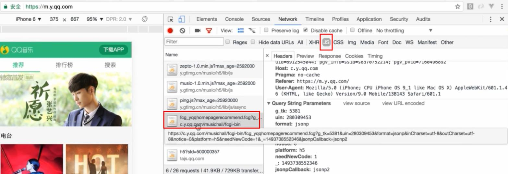

# recommend推荐页面

> 推荐首页与歌单详情页

## 目录
[**1-jsonp抓取数据**](#1-jsonp抓取数据)<br>
[**2-轮播图数据抓取**](#2-轮播图数据抓取)<br>
[**3-轮播组件**](#3-轮播组件)<br>
[**4-歌单**](#4-歌单)<br>
- [4.1 公用scroll组件](#41-公用scroll组件)<br>

[**5-vue-lazyload懒加载**](#5-vue-lazyload懒加载)<br>
[**6-loading基础组件**](#6-loading基础组件)

## <a id="1-jsonp抓取数据"></a>1-jsonp抓取数据
数据的获取来源于qq音乐 [https://y.qq.com/](https://y.qq.com/)  (移动端network中js方式的请求数据) <br>
例：[https://c.y.qq.com/musichall/fcgi-bin/fcg_yqqhomepagerecommend.fcg?g_tk=5381&uin=280309453&format=jsonp&inCharset=utf-8&outCharset=utf-8&notice=0&platform=h5&needNewCode=1&_=1493738552346&jsonpCallback=jsonp2](https://c.y.qq.com/musichall/fcgi-bin/fcg_yqqhomepagerecommend.fcg?g_tk=5381&uin=280309453&format=jsonp&inCharset=utf-8&outCharset=utf-8&notice=0&platform=h5&needNewCode=1&_=1493738552346&jsonpCallback=jsonp2)


数据获取的方式jsonp  [https://github.com/webmodules/jsonp](https://github.com/webmodules/jsonp)

```javascript
cnpm install jsonp --save 
```
src/common/js/jsonp.js 封装数据获取的方法
```javascript
import originJsonp from 'jsonp'

/**
 * @param {*} url   请求url
 * @param {*} data  拼接在url后面的参数
 * @param {*} option  option
 */
export default function jsonp(url, data, option) {
  url += (url.indexOf('?') < 0 ? '?' : '&') + param(data)
  return new Promise((resolve, reject) => {
    originJsonp(url, option, (err, data) => {
      if (!err) {
        resolve(data)
      } else {
        reject(err)
      }
    })
  })
}

function param(data) {
  let url = ''
  for (var k in data) {
    let value = data[k] !== undefined ? data[k] : ''
    url += `&${k}=${encodeURIComponent(value)}`
  }
  return url ? url.substring(1) : ''
}
```
## <a id="2-轮播图数据抓取"></a>2-轮播图数据抓取

src/api/recommend.js
```javascript
// 推荐页面获取数据
import jsonp from 'common/js/jsonp.js'
import {commonParams, options} from './config.js'

/**
 * 推荐数据抓取
 */
export function getRecommend() {
  const url = 'https://c.y.qq.com/musichall/fcgi-bin/fcg_yqqhomepagerecommend.fcg'
  const data = Object.assign({}, commonParams, {
    platform: 'h5',
    uin: 0,
    needNewCode: 1
  })
  return jsonp(url, data, options)
}
```
src/api/config.js
```javascript
// 公共参数配置
export const commonParams = {
  g_tk: 5381,
  inCharset: 'utf-8',
  outCharset: 'utf-8',
  notice: 0,
  format: 'jsonp'
}

export const options = {
  param: 'jsonpCallback'
}

export const ERR_OK = 0
```
src/components/recommend/recommend.vue
```html
<!-- 推荐页面 -->
<template>
  <div class="recommend">
    <div class="recommend-content">
      <div v-if="recommends.length" class="slider-wrapper">
        <slider>
          <div v-for="(item, index) in recommends" :key="index">
            <a :href="item.linkUrl">
              
            </a>
          </div>
        </slider>
      </div>
      <div class="recommend-list">
        <h1 class="list-title">热门歌单推荐</h1>
        <ul></ul>
      </div>
    </div>
  </div>
</template>
```
```javascript
import Slider from 'base/slider/slider'
import {getRecommend} from 'api/recommend.js'
import {ERR_OK} from 'api/config.js'

export default {
  data() {
    return {
      recommends: [] // 轮播图数据
    }
  },
  created() {
    this._getRecommend()
  },
  methods: {
    _getRecommend() {
      getRecommend().then((res) => {
        if (res.code === ERR_OK) {
          this.recommends = res.data.slider
        }
      })
    }
  },
  components: {
    Slider
  }
}
```
## <a id="3-轮播组件"></a>3-轮播组件
[http://ustbhuangyi.github.io/better-scroll/doc/](http://ustbhuangyi.github.io/better-scroll/doc/)

```
cnpm install better-scroll --save
```
dom操作方法封装src/common/js/dom.js
```javascript
// dom操作方法
/**
 * 判断是否存在某个class类名
 * @param {*} el
 * @param {*} className
 */
export function hasClass(el, className) {
  let reg = new RegExp('(^|\\s)' + className + '(\\s|$)')
  return reg.test(el.className)
}

/**
 * 添加class类名
 * @param {*} el
 * @param {*} className
 */
export function addClass(el, className) {
  if (hasClass(el, className)) {
    return
  }
  let newClass = el.className.split(' ')
  newClass.push(className)
  el.className = newClass.join(' ')
}
```
轮播组件 src/base/slider/slider.vue
```html
<template>
  <div class="slider" ref="slider">
    <div class="slider-group" ref="sliderGroup">
      <slot></slot>
    </div>
    <div class="dots">
      <span class="dot" v-for="(item, index) in dots" :key="index" :class="{active: currentPageIndex === index}"></span>
    </div>
  </div>
</template>
```
```javascript
import BScroll from 'better-scroll'
import {addClass} from 'common/js/dom'

export default {
  name: 'slider',
  props: {
    loop: { // 循环轮播
      type: Boolean,
      default: true
    },
    autoPlay: { // 自动轮播
      type: Boolean,
      default: true
    },
    interval: { // 几秒轮播一次
      type: Number,
      default: 4000
    }
  },
  data() {
    return {
      dots: [],
      currentPageIndex: 0  // 当前页码
    }
  },
  mounted() {
    let self = this
    setTimeout(function() {
      self._setSliderWidth()
      self._initDots()
      self._initSlider()

      if (self.autoPlay) {
        self._play()
      }
    }, 20)

    window.addEventListener('resize', () => {
      if (!this.slider) {
        return
      }
      this._setSliderWidth(true)
      this.slider.refresh()
    })
  },
  methods: {
    // 根据内容设置容器宽度
    _setSliderWidth(isResize) {
      this.children = this.$refs.sliderGroup.children
      let width = 0
      let sliderWidth = this.$refs.slider.clientWidth
      for (let i = 0; i < this.children.length; i++) {
        let child = this.children[i]
        addClass(child, 'slider-item')
        child.style.width = sliderWidth + 'px'
        width += sliderWidth
      }
      if (this.loop && !isResize) {
        width += 2 * sliderWidth  // 循环前后各需要复制一张作为动画的过度
      }
      this.$refs.sliderGroup.style.width = width + 'px'
    },
    // 初始化滚动
    _initSlider() {
      this.slider = new BScroll(this.$refs.slider, {
        scrollX: true, // 横向滚动
        scrollY: false,
        momentum: false,
        snap: {
          loop: this.loop,
          threshold: 0.3,
          speed: 400
        }
      })
      // 每次滚动完毕时
      this.slider.on('scrollEnd', () => {
        let pageIndex = this.slider.getCurrentPage().pageX
        this.currentPageIndex = pageIndex
        if (this.autoPlay) {
          this._play()
        }
      })
      // 在滚动开始之前
      this.slider.on('beforeScrollStart', () => {
        if (this.autoPlay) {
          clearTimeout(this.timer)
        }
      })
    },
    // 初始化轮播的圆点
    _initDots() {
      this.dots = new Array(this.children.length)
    },
    _play() {
      // 滚动到下一张
      this.timer = setTimeout(() => {
        this.slider.next()
      }, this.interval)
    }
  },
  destroyed() {
    clearTimeout(this.timer)
  }
}
```
## <a id="4-歌单"></a>4-歌单
src/components/recommend/recommend.vue
```javascript
methods: {
  // 推荐数据获取
  _getRecommend() {
    getRecommend().then((res) => {
      if (res.code === ERR_OK) {
        this.recommends = res.data.slider // 轮播图数据
        this.discList = res.data.songList // 歌单数据
      }
    })
  }
},
```
```html
<div class="recommend-list">
  <h1 class="list-title">热门歌单推荐</h1>
  <ul>
    <li class="item" v-for="(item, index) in discList" :key="index">
      <div class="icon">
        
      </div>
      <div class="text">
        <h2 class="name">{{item.songListDesc}}</h2>
        <p class="author">{{item.songListAuthor}}</p>
      </div>
    </li>
  </ul>
</div>
```
### <a id="41-公用scroll组件"></a>4.1 公用scroll组件
base/scroll/scroll.vue

```html
<!-- scroll组件 -->
<template>
  <div ref="wrapper">
    <slot></slot>
  </div>
</template>
```
```javascript
<script type="text/ecmascript-6">
import BScroll from 'better-scroll'

export default {
  name: 'slider',
  props: {
    probeType: { // 帮助知道滚动的位置
      type: Number,
      default: 1
    },
    click: { // 是否派发click事件, better-scroll默认会阻止浏览器的原生 click 事件
      type: Boolean,
      default: true
    },
    /**
     * data变化时，需要 refresh，重新计算 better-scroll，
     * _initScroll()是在mounted中，初始化时异步获取的数据可能还没请求回来
     * 监听data变化，重新refresh，实现滚动
     */
    data: {
      type: Array,
      default: null
    }
  },
  data() {
    return {
      dots: [],
      currentPageIndex: 0
    }
  },
  mounted() {
    setTimeout(() => {
      this._initScroll()
    }, 20)
  },
  methods: {
    // 初始化滚动
    _initScroll() {
      if (!this.$refs.wrapper) {
        return
      }
      this.scroll = new BScroll(this.$refs.wrapper, {
        probeType: this.probeType,
        click: this.click
      })
    },
    disable() { // 禁用 better-scroll
      this.scroll && this.scroll.disable()
    },
    enable() { // 启用 better-scroll
      this.scroll && this.scroll.enable()
    },
    refresh() { // 重新计算 better-scroll
      this.scroll && this.scroll.refresh()
    }
  },
  watch: {
    data() {
      setTimeout(() => {
        this.refresh()
      }, 20)
    }
  }
}
</script>
```

使用：
src/components/recommend/recommend.vue
```html
<!-- better-scroll滚动refresh在于两个地方的数据变化：轮播数据与歌单数据变化时都需重新计算 -->
<!-- 传入data:discList歌单数据,因为recommends轮播数据在discList之前获取，有内容了，所以这里传入discList即可 -->
<!-- recommends轮播数据存在img图片异步，轮播的内容是由img高度撑起来的，so在img加载时需重新计算better-scroll，即loadImage方法 -->
<scroll ref="scroll" class="recommend-content" :data="discList">
  <div>
    <!-- 轮播 -->
    <div v-if="recommends.length" class="slider-wrapper">
      ......
      
      ......
    </div>
    <!-- 歌单列表 -->
    <div class="recommend-list">
      ......
    </div>
  </div>
</scroll>
```
```javascript
import Scroll from 'base/scroll/scroll'
methods: {
  // 轮播img加载时重新计算better-scroll
  loadImage() {
    if (!this.checkLoaded) { // 一次加载，一张img加载即达到目的，防止多张img重复刷新
      this.checkLoaded = true
      this.$refs.scroll.refresh()
    }
  }
},
components: {
  Slider
}
```
如果此时banner点击跳转不了，better-scroll默认派发click事件，有可能是better-scroll与fastclick冲突了，可以在轮播图的a标签加上`class="needsclick"`解决。

## <a id="5-vue-lazyload懒加载"></a>5-vue-lazyload懒加载

[https://github.com/hilongjw/vue-lazyload](https://github.com/hilongjw/vue-lazyload)

```javascript
cnpm install vue-lazyload --save
```
src/main.js
```javascript
import VueLazyLoad from 'vue-lazyload'
Vue.use(VueLazyLoad, {
  loading: require('common/image/default.png') // 默认图片
})
```
src/components/recommend/recommend.vue
```html

```

## <a id="6-loading基础组件"></a>6-loading基础组件

src/base/loading

使用:src/components/recommend/recommend.vue
```javascript
<div class="loading-container" v-show="!discList.length">
  <loading></loading>
</div>

import Loading from 'base/loading/loading'
export default {
  components: {
    Loading
  }
}
```


