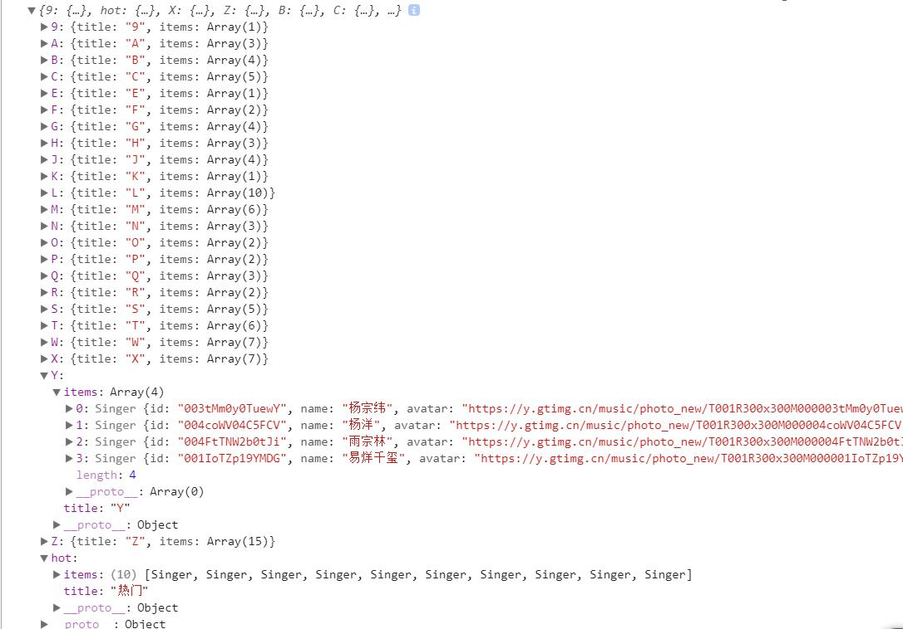
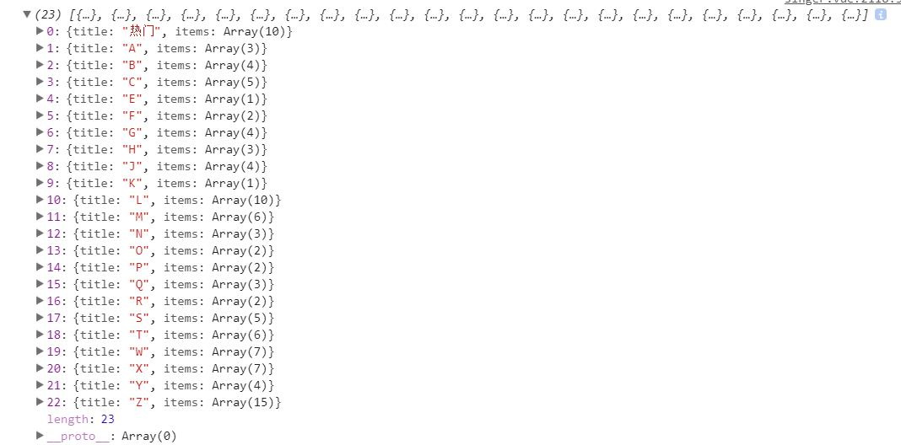
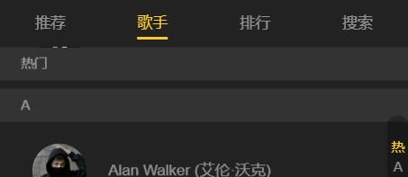
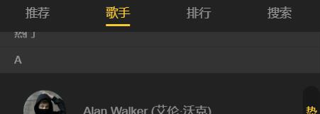
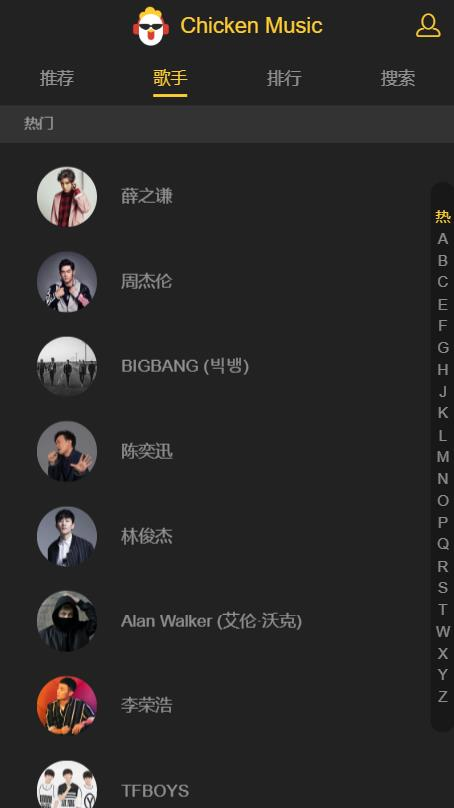

# singer歌手页面

> 歌手页面

## 目录
- [**1-歌手数据抓取**](#1-歌手数据抓取)
- [**2-规范化数据**](#2-规范化数据)
- [**3-列表组件渲染与右侧字母列表**](#3-列表组件渲染与右侧字母列表)
  - [3.1-数据渲染](#31-数据渲染)
  - [3.2-字母列表添加手指按下滚到指定位置](#32-字母列表添加手指按下滚到指定位置)
  - [3.3-手指在字母列表滑动时滚动到指定位置](#33-手指在字母列表滑动时滚动到指定位置)
  - [3.4-左右列表联动，字母高亮](#34-左右列表联动，字母高亮)
  - [3.5-点击字母对应高亮](#35-点击字母对应高亮)
  - [3.6-实现滚动固定标题](#36-实现滚动固定标题)
  - [3.7-添加loading](#37-添加loading)

## <a id="1-歌手数据抓取"></a>1-歌手数据抓取

jsonp抓取数据方式参考02-recommend.md <br>[https://github.com/ccyinghua/vue-music/blob/master/02-recommend.md](https://github.com/ccyinghua/vue-music/blob/master/02-recommend.md)
<br>
<br>
歌手数据的获取来源于qq音乐 [https://y.qq.com/portal/singer_list.html](https://y.qq.com/portal/singer_list.html)<br>
例：[https://c.y.qq.com/v8/fcg-bin/v8.fcg?channel=singer&page=list&key=all_all_all&pagesize=100&pagenum=1&g_tk=1664029744&jsonpCallback=GetSingerListCallback&loginUin=280309453&hostUin=0&format=jsonp&inCharset=utf8&outCharset=utf-8&notice=0&platform=yqq&needNewCode=0](https://c.y.qq.com/v8/fcg-bin/v8.fcg?channel=singer&page=list&key=all_all_all&pagesize=100&pagenum=1&g_tk=1664029744&jsonpCallback=GetSingerListCallback&loginUin=280309453&hostUin=0&format=jsonp&inCharset=utf8&outCharset=utf-8&notice=0&platform=yqq&needNewCode=0)


src/api/singer.js
```javascript
// 歌手页面获取数据
import jsonp from 'common/js/jsonp.js'
import {commonParams, options} from './config.js'

/**
 * 歌手数据抓取
 */
export function getSingerList() {
  const url = 'https://c.y.qq.com/v8/fcg-bin/v8.fcg'
  const data = Object.assign({}, commonParams, {
    channel: 'singer',
    page: 'list',
    key: 'all_all_all',
    pageSize: 100,
    pagenum: 1,
    hostUin: 0,
    needNewCode: 0,
    platform: 'yqq',
    g_tk: 1664029744
  })
  return jsonp(url, data, options)
}
```
src/components/singer/singer.vue
```javascript
import { getSingerList } from 'api/singer'
import { ERR_OK } from 'api/config'

export default {
  data() {
    return {
      singers: []
    }
  },
  created() {
    this._getSingerList()
  },
  methods: {
    // 获取歌手数据
    _getSingerList() {
      getSingerList().then((res) => {
        if (res.code === ERR_OK) {
          this.singers = res.data.list
          console.log(this.singers)
        }
      })
    }
  }
}
```

## <a id="2-规范化数据"></a>2-规范化数据

将歌手数据规范成页面所需格式，提取所需数据，按照热门+字母分类整理。

src/common/singer.js
```javascript
/**
 * 构造Singer类
 */
export default class Singer {
  constructor({id, name}) {
    this.id = id
    this.name = name
    this.avatar = `https://y.gtimg.cn/music/photo_new/T001R300x300M000${id}.jpg?max_age=2592000`
  }
}
```
src/components/singer/singer.vue

```javascript
const HOT_NAME = '热门'
const HOT_SINGRT_LEN = 10 // 热门数据为10条

// 规范化歌手数据:提取页面所需数据，将歌手数据按照热门+字母分类处理
methods:{
  _normalLizeSinger(list) {
    let map = {
      hot: {
        title: HOT_NAME,
        items: []
      }
    }
    list.forEach((item, index) => {
      // 填充热门数据
      if (index < HOT_SINGRT_LEN) {
        map.hot.items.push(new Singer({
          id: item.Fsinger_mid,
          name: item.Fsinger_name
        }))
      }
      const key = item.Findex
      if (!map[key]) {
        map[key] = {
          title: key,
          items: []
        }
      }
      map[key].items.push(new Singer({
        id: item.Fsinger_mid,
        name: item.Fsinger_name
      }))
    })
    // console.log(map)
    /**
     * 为了得到有序列表，处理 map
     */
    let hot = []
    let ret = []
    for (let key in map) {
      let val = map[key]
      if (val.title.match(/[a-zA-Z]/)) { // 匹配字母
        ret.push(val)
      } else if (val.title === HOT_NAME) { // 匹配"热门"
        hot.push(val)
      }
    }
    // 对ret数组进行字母排序a-z
    ret.sort((a, b) => {
      return a.title.charCodeAt(0) - b.title.charCodeAt(0)
    })
    return hot.concat(ret)
  }
}
```
`console.log(this._normalLizeSinger(this.singers))`输出结果，处理map前：


处理map后：


## <a id="3-列表组件渲染与右侧字母列表"></a>3-列表组件渲染与右侧字母列表

### <a id="31-数据渲染"></a>3.1-数据渲染

在规范化数据，得到想要的格式的数据之后，将数据渲染在歌手页中，列表的渲染在 [base/listview/listview.vue](https://github.com/ccyinghua/vue-music/blob/master/src/base/listview/listview.vue) 中，列表的渲染包括：
- 歌手数据渲染(歌手数据由父组件singer.vue提供)
- 右侧字母列表渲染(字母列表提取歌手数据的title)

### <a id="32-字母列表添加手指按下滚到指定位置"></a>3.2-字母列表添加手指按下滚到指定位置

给字母列表元素添加`data-index`属性，属性值为每个字母的索引，手指按下时，左侧歌手列表根据索引滚动到指定位置。
- 使用到了better-scroll的`scrollToElement`方法
- 添加dom操作：获取元素的`data-`属性值方法

common/js/dom.js
```javascript
/**
 * 操作'data-'属性
 * @param {*} el    dom对象
 * @param {*} name  属性'data-'后面的字段，例'data-index',name值为'index'
 * @param {*} val   val值，如果传入val值代表要设置元素的data-属性，不传入代表只获取元素的'data-'属性
 */
export function getData(el, name, val) {
  const prefix = 'data-'
  if (val) {
    return el.setAttribute(prefix + name, val)
  }
  return el.getAttribute(prefix + name)
}
```
base/scroll/scroll.vue添加方法
```javascript
scrollTo() { // 滚动到指定位置
  this.scroll && this.scroll.scrollTo.apply(this.scroll, arguments)
},
scrollToElement() { // 滚动到指定的目标元素
  this.scroll && this.scroll.scrollToElement.apply(this.scroll, arguments)
}
```
base/listview/listview.vue
```html
<scroll class="listview" :data="data" ref="listview">
  <!-- 歌手列表 -->
  <ul>
    <li v-for="group in data" :key="group.title" class="list-group" ref="listgroup">...</li>
  </ul>
  <!-- 右侧字母列表 -->
  <div class="list-shortcut" @touchstart="onShortcutTouchStart">
    <ul>
      <li v-for="(item, index) in shortcutList" :key="item" class="item" :data-index="index">{{item}}</li>
    </ul>
  </div>
</scroll>
```
```javascript
// 字母列表手指按下
onShortcutTouchStart(e) {
  console.log(e.target)
  // e.target为按下的字母： 例按下A字母输出 '<li data-index="1" class="item">A</li>'
  let authorIndex = getData(e.target, 'index')
  this.$refs.listview.scrollToElement(this.$refs.listgroup[authorIndex], 0)
}
```

### <a id="33-手指在字母列表滑动时滚动到指定位置"></a>3.3-手指在字母列表滑动时滚动到指定位置

手指按下时记录按下时的字母y坐标和索引，手指移动后记录移动后的字母y坐标，通过前后y轴偏差的距离除以每个字母的高度，得到手指猴移动后的字母的索引index值，设置滚动。

base/listview/listview.vue
```javascript
const TITLE_HEIGHT = 30 // 左侧歌手列表title的高度
const ANCHOR_HEIGHT = 18 // 字母列表每个字母的高度

export default {
  created() {
    this.touch = {}
  },
  methods: {
    // 字母列表手指按下
    onShortcutTouchStart(e) {
      // e.target为按下的字母： 例按下A字母输出 '<li data-index="1" class="item">A</li>'
      console.log(e.target)
      let anchorIndex = getData(e.target, 'index')
      let firstTouch = e.touches[0] // e.touches当前跟踪的触摸操作的touch对象的数组
      this.touch.y1 = firstTouch.pageY // 触摸目标在页面中的y坐标
      this.touch.anchorIndex = anchorIndex // 记录刚开始按下的index
      // this.$refs.listview.scrollToElement(this.$refs.listgroup[anchorIndex], 0)
      this._scrollTo(anchorIndex)
    },
    // 手指在字母列表滑动时
    onshortcutTouchMove(e) {
      let firstTouch = e.touches[0]
      this.touch.y2 = firstTouch.pageY
      let delta = (this.touch.y2 - this.touch.y1) / ANCHOR_HEIGHT | 0 // y轴的偏移个数
      let anchorIndex = parseInt(this.touch.anchorIndex + delta) // 得到手指移动后所在的字母index
      this._scrollTo(anchorIndex)
    },
    // 设置滚动
    _scrollTo(anchorIndex) {
      this.$refs.listview.scrollToElement(this.$refs.listgroup[anchorIndex], 0)
    }
  }
}
```

### <a id="34-左右列表联动，字母高亮"></a>3.4-左右列表联动，字母高亮

实现在滚动过程中对应的字母分类高亮：
- `scroll`组件添加监听滚动事件，派发实时的滚动位置信息给父组件接收
- 父组件`listview`首先计算左侧歌手列表每个group(字母分类)的所在的高度数组集合listHeight
- 将接收的位置信息y的值`scrollY`与`listHeight`数组比较，分析出`scrollY`在数组的那个区间，得到当前应高亮的索引`currentIndex`
- 得到`currentIndex`,给字母列表添加高亮class类名`current`,当`currentIndex === index`时，对应高亮

子组件base/scroll/scroll.vue
```javascript
props: {
  listenScroll: { // 是否监听滚动
    type: Boolean,
    default: false
  }
},
methods: {
  // 初始化滚动
  _initScroll() {
    ......
    if (this.listenScroll) {
      let self = this
      this.scroll.on('scroll', (pos) => {
        self.$emit('scroll', pos) // 派发事件，传送滚动时的位置信息
      })
    }
  }
}
```
父组件base/listview/listview.vue
```html
<!-- 字母列表组件 -->
<template>
  <scroll
    class="listview"
    ref="listview"
    :data="data"
    :probeType="probeType"
    :listenScroll="listenScroll"
    @scroll="scroll"
    >
    <!-- 右侧字母列表 -->
    <div class="list-shortcut" @touchstart="onShortcutTouchStart" @touchmove.stop.prevent="onshortcutTouchMove">
      <ul>
        <li v-for="(item, index) in shortcutList"
            :key="item"
            class="item"
            :class="{'current': currentIndex === index}"
            :data-index="index">
          {{item}}
        </li>
      </ul>
    </div>
  </scroll>
</template>
```
```javascript
export default {
  created() {
    this.touch = {}
    this.probeType = 3 // 设置实时派发scroll事件
    this.listenScroll = true // 设置监听滚动传入子组件
    this.listHeight = [] // 左歌手列表每个group的所在高度集合
  },
  data() {
    return {
      scrollY: -1, // 实时滚动的y的距离
      currentIndex: 0 // 当前应高亮的index
    }
  },
  methods: {
    // 接收子组件派发的滚动事件
    scroll(pos) {
      this.scrollY = pos.y
    },
    // 计算左侧歌手列表每个group的高度
    _calculateHeight() {
      this.listHeight = []
      const list = this.$refs.listgroup
      let height = 0
      this.listHeight.push(height) // 第1个group所在高度为0
      for (let i = 0; i < list.length; i++) {
        let item = list[i]
        height += item.clientHeight
        this.listHeight.push(height)
      }
    }
  },
  watch: {
    data() {
      setTimeout(() => {
        this._calculateHeight()
      }, 20)
    },
    scrollY(newY) {
      const listHeight = this.listHeight
      for (let i = 0; i < listHeight.length; i++) {
        let height1 = listHeight[i]
        let height2 = listHeight[i + 1]
        if (!height2 || (-newY > height1 && -newY < height2)) { // i是最后一个，或滚动到了上一个与下一个之间
          this.currentIndex = i // 第i个高亮
          console.log(this.currentIndex)
          return
        }
      }
      this.currentIndex = 0
    }
  }
}
```
以上 监听`scrollY`存在明显问题，当滚动到顶部或者底部时，有时会存在右侧字母没有一个高亮的情况，修改监听`scrollY`逻辑

```javascript
scrollY(newY) {
  // console.log(newY)
  const listHeight = this.listHeight
  // 当滚动到顶部，newY > 0
  if (newY > 0) {
    this.currentIndex = 0
    return
  }
  // 在中间部分滚动
  for (let i = 0; i < (listHeight.length - 1); i++) {
    let height1 = listHeight[i]
    let height2 = listHeight[i + 1]
    if (-newY >= height1 && -newY < height2) { // i滚动到了上一个与下一个之间
      this.currentIndex = i // 第i个高亮
      console.log(this.currentIndex)
      return
    }
  }
  // 当滚动到底部，且-newY大于最后一个元素的上限(即listHeight的倒数第二个值)
  this.currentIndex = listHeight.length - 2
}
```

### <a id="35-点击字母对应高亮"></a>3.5-点击字母对应高亮

目前已做到滚动时对应高亮，滚动高亮是由监听滚动获取滚动位置设置的，当点击字母时，滚到指定位置时通过better-scroll的滚到指定元素`scrollToElement`方法设置的，并没有触发better-scroll的监听滚动。
- 在点击字母时`_scrollTo`方法已经设置了滚动到指定元素，可以在滚动时手动设置`scrollY`的值(因为高亮是监听scrollY设置的)
- 字母列表手指按下与手指移动事件(`touchstart`与`touchmove`)是对于字母列表整个div添加的，需要考虑一下字母以外的边界位置的触碰

base/listview/listview.vue
```javascript
// 设置滚动
_scrollTo(anchorIndex) {
  console.log(anchorIndex)
  // 设置点击.list-shortcut边界无反应
  if (!anchorIndex && anchorIndex !== 0) {
    return
  }
  if (anchorIndex < 0) { // 手指移动至字母列表顶部空白区域,设置第一个高亮
    anchorIndex = 0
  } else if (anchorIndex > this.listHeight.length - 2) { // 手指移动至字母列表底部空白区域，设置最后一个高亮
    anchorIndex = this.listHeight.length - 2
  }
  this.scrollY = -this.listHeight[anchorIndex] // 手动设置scrollY,实现点击字母对应高亮
  this.$refs.listview.scrollToElement(this.$refs.listgroup[anchorIndex], 0)
}
```

### <a id="36-实现滚动固定标题"></a>3.6-实现滚动固定标题

- 滚动时顶部显示对应标题
- 列表标题与顶部固定显示标题即将重合时有个过渡效果，把上一个标题顶上去的效果

1、标题显示
base/listview/listview.vue
```html
<!-- 固定标题 -->
<div class="list-fixed" ref="fixed" v-show="fixedTitle">
  <div class="fixed-title">{{fixedTitle}}</div>
</div>
```
```javascript
computed: {
  fixedTitle() {
    if (this.scrollY > 0) {
      return ''
    }
    return this.data[this.currentIndex] ? this.data[this.currentIndex].title : ''
  }
},
```
2、过渡效果<br>
- 获取下一个标题与顶部固定标题的距离值(在监听滚动时可以获取)
- 当两个标题栏即将有重合，但是又不完全重合时，计算重合的部分，设置顶部标题在Y轴向上移动对应距离，呈现类似标题更换效果。

```javascript
data() {
  return {
    diff: -1 // 中间滚动时，列表标题栏与顶部固定标题栏的距离差
  }
},
watch: {
  scrollY(newY) {
    ...
    // 在中间部分滚动时
    this.diff = height2 + newY
    ...
  },
  diff(newVal) {
    // (newVal > 0 && newVal < TITLE_HEIGHT)代表列表标题与顶部标题栏有重合但是没有完全重合
    let fixedTop = (newVal > 0 && newVal < TITLE_HEIGHT) ? newVal - TITLE_HEIGHT : 0
    if (this.fixedTop === fixedTop) {
      return
    }
    this.fixedTop = fixedTop
    this.$refs.fixed.style.transform = `translate3d(0, ${fixedTop}px, 0)`
  }
}
```



### <a id="37-添加loading"></a>3.7-添加loading
```html
<!-- loading -->
<div v-show="!data.length" class="loading-container">
  <loading></loading>
</div>
<script type="text/ecmascript-6">
import Loading from 'base/loading/loading'
export default {
  components: {
    Loading
  }
}
</script>
```
歌手页面：<br>
