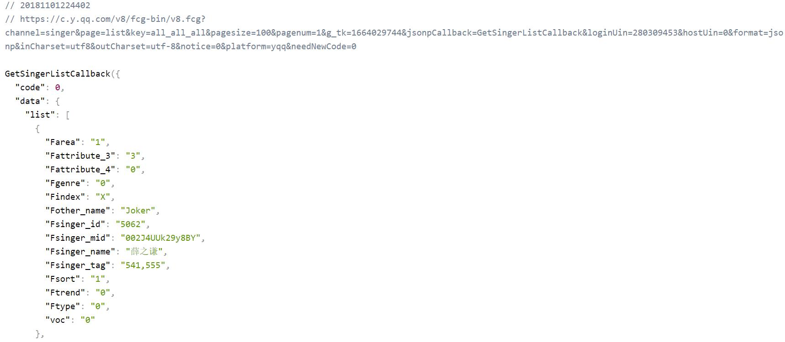

# singer歌手页面

> 歌手页面

## 目录
[**1-歌手数据抓取**](#1-歌手数据抓取)
- [1.1 xxx](#11-xxx)

## <a id="1-歌手数据抓取"></a>1-歌手数据抓取

jsonp抓取数据方式参考02-recommend.md <br>[https://github.com/ccyinghua/vue-music/blob/master/02-recommend.md](https://github.com/ccyinghua/vue-music/blob/master/02-recommend.md)
<br>
<br>
歌手数据的获取来源于qq音乐 [https://y.qq.com/portal/singer_list.html](https://y.qq.com/portal/singer_list.html)<br>
例：[https://c.y.qq.com/v8/fcg-bin/v8.fcg?channel=singer&page=list&key=all_all_all&pagesize=100&pagenum=1&g_tk=1664029744&jsonpCallback=GetSingerListCallback&loginUin=280309453&hostUin=0&format=jsonp&inCharset=utf8&outCharset=utf-8&notice=0&platform=yqq&needNewCode=0](https://c.y.qq.com/v8/fcg-bin/v8.fcg?channel=singer&page=list&key=all_all_all&pagesize=100&pagenum=1&g_tk=1664029744&jsonpCallback=GetSingerListCallback&loginUin=280309453&hostUin=0&format=jsonp&inCharset=utf8&outCharset=utf-8&notice=0&platform=yqq&needNewCode=0)


src/api/singer.js
```javascript
// 歌手页面获取数据
import jsonp from 'common/js/jsonp.js'
import {commonParams, options} from './config.js'

/**
 * 歌手数据抓取
 */
export function getSingerList() {
  const url = 'https://c.y.qq.com/v8/fcg-bin/v8.fcg'
  const data = Object.assign({}, commonParams, {
    channel: 'singer',
    page: 'list',
    key: 'all_all_all',
    pageSize: 100,
    pagenum: 1,
    hostUin: 0,
    needNewCode: 0,
    platform: 'yqq',
    g_tk: 1664029744
  })
  return jsonp(url, data, options)
}
```
src/components/singer/singer.vue
```javascript
import { getSingerList } from 'api/singer'
import { ERR_OK } from 'api/config'

export default {
  data() {
    return {
      singers: []
    }
  },
  created() {
    this._getSingerList()
  },
  methods: {
    // 获取歌手数据
    _getSingerList() {
      getSingerList().then((res) => {
        if (res.code === ERR_OK) {
          this.singers = res.data.list
          console.log(this.singers)
        }
      })
    }
  }
}
```

## <a id="2-规范化数据"></a>2-规范化数据

将歌手数据规范成页面所需格式，提取所需数据，按照热门+字母分类整理。


