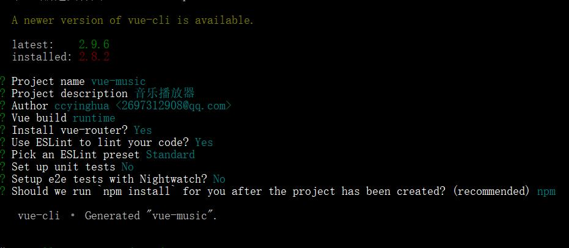

# vue-music

> vue移动端音乐WebApp

### 运行项目

```javascript
npm install

npm run dev
```

### 构建项目

```javascript
vue init webpack vue-music

cnpm install
npm run dev

cnpm install stylus stylus-loader --save-dev  // 安装stylus处理css

cnpm install babel-runtime --save  // 对ES语法进行转义 

cnpm install fastclick --save  // 解决移动端一些body点击事件的延迟

cnpm install babel-polyfill --save-dev  // 对ES6的一些新API转义，补丁

cnpm install jsonp --save  // jsonp方式抓取数据https://github.com/webmodules/jsonp  参考02-recommend.md

cnpm install better-scroll --save // 轮播滚动插件 http://ustbhuangyi.github.io/better-scroll/doc/  参考02-recommend.md

```


1、安装fastclick之后，main.js入口文件
```js
import fastclick from 'fastclick'
fastclick.attach(document.body);
```
2、安装babel-polyfill之后，main.js
```js
// 需放在第一行
import 'babel-polyfill'
```

> 文件夹列表

```javascript
| - build
| - config
| - resource      -- Markdown文件所用资源图片(项目中可以不要)
| - src
    | - api             -- 放后端请求类的代码(ajax，json请求等)
    | - base            -- 基本通用组件
      | - slider            -- 轮播组件
    | - common          -- 通用的静态资源
        | - fonts           -- 字体文件
        | - image           -- 图片文件
        | - js              -- js文件
        | - stylus          -- 样式文件
    | - components      -- 组件
        | - m-header        -- header头部组件
        | - rank            -- 排行页面
        | - recommend       -- 推荐页面
        | - search          -- 搜索页面
        | - singer          -- 歌手页面
        | - tab             -- Tab栏组件
    | - router          -- 路由配置文件
    | - store           -- vuex相关文件
    | - App.vue
    | - main.js
| - static   -- 项目所用图片，图标
......

```

> 配置修改

```javascript
1、修改路径配置
// webpack.base.conf.js
alias: {
    '@': resolve('src'),
    'common': resolve('src/common'),
    'components': resolve('src/components'),
    'base': resolve('src/base'),
    'api': resolve('src/api')
}
```

> Markdown说明文件

- [1-header头部组件与页面骨架](https://github.com/ccyinghua/vue-music/blob/master/01-header.md)<br>
- [2-recommend推荐页面](https://github.com/ccyinghua/vue-music/blob/master/02-recommend.md)


未完待续......


